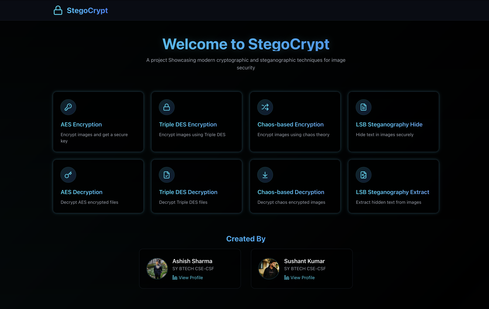
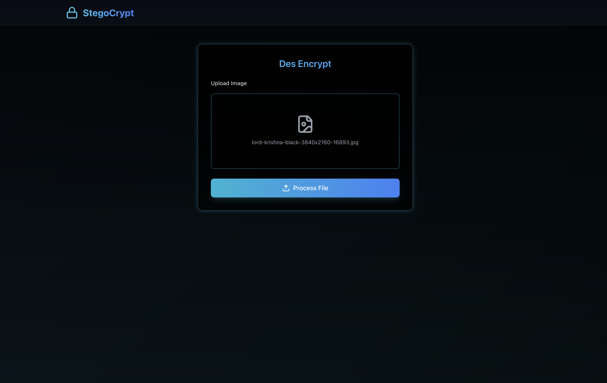
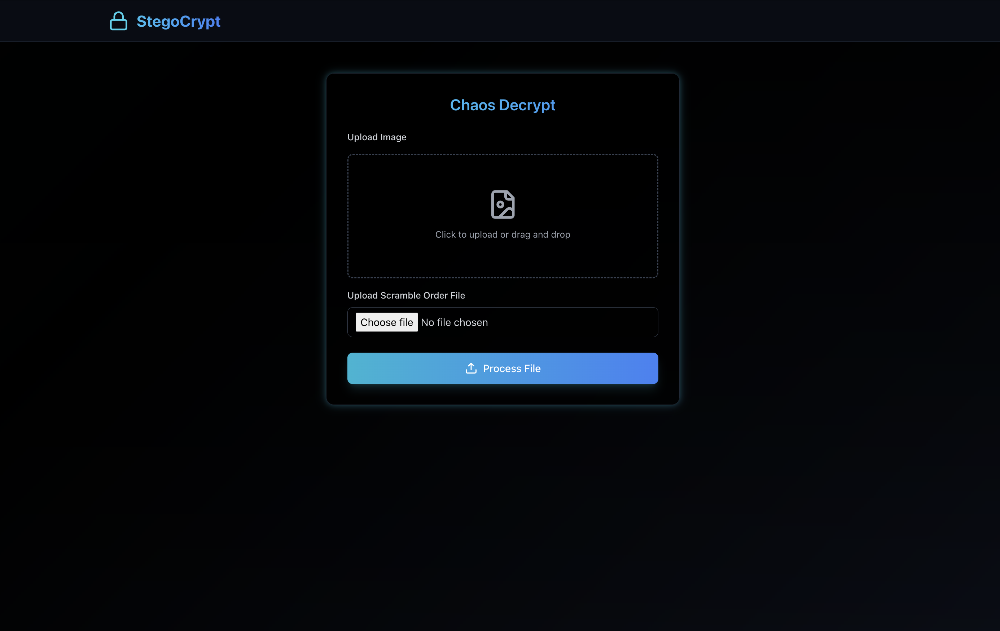
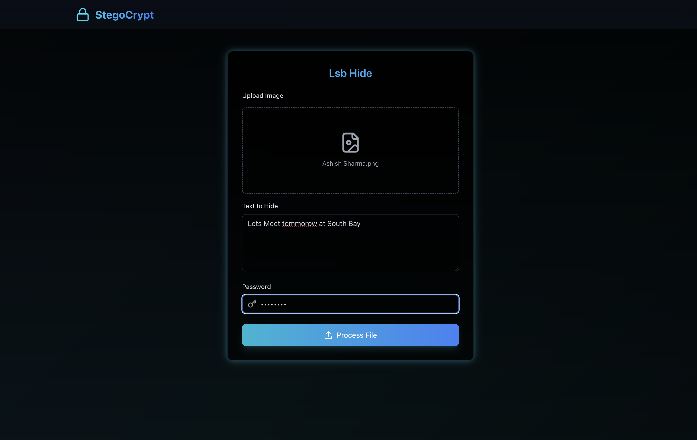
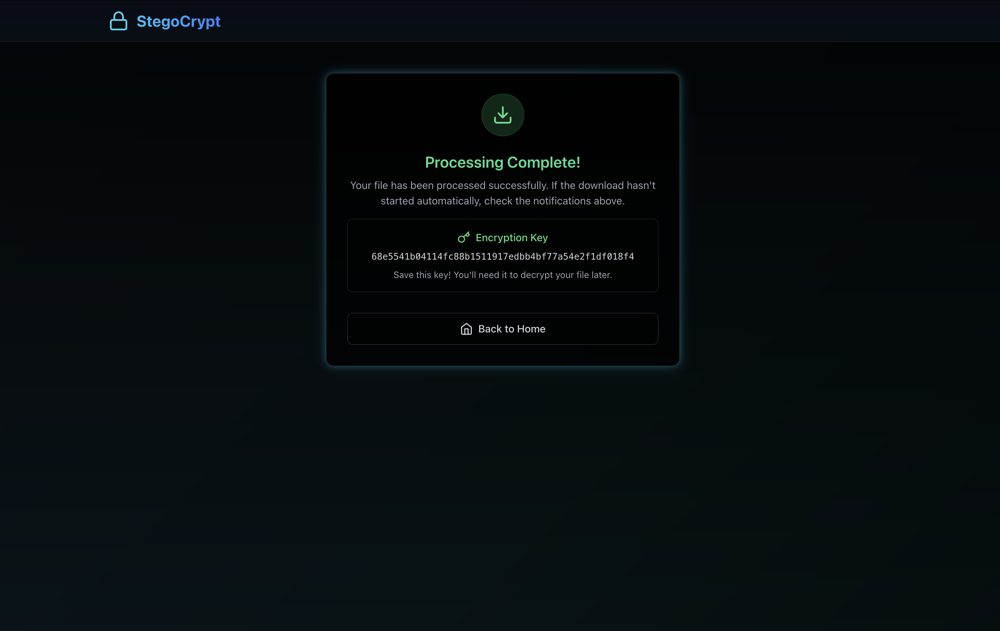

# StegoCrypt  

A web-based application that implements modern cryptographic and steganographic techniques for secure image encryption, decryption, and data hiding.  

## Features  
 
- **AES Encryption & Decryption**  
  Leverages the **Advanced Encryption Standard (AES)** to securely encrypt images, generating a unique decryption key. The original image can only be restored by providing the correct key.  
 
- **Triple DES Encryption & Decryption**  
  Implements the **Triple DES algorithm** to enhance security by encrypting data multiple times with distinct keys, adding an extra layer of protection.  
 
- **Chaos-Based Image Encryption**  
  Uses a **logistic map-based chaotic system** to randomly scramble pixel values, ensuring extreme sensitivity to initial conditions. Without the precise parameters, decryption is practically impossible.  
 
- **LSB Steganography (Hide & Extract)**  
  Embeds confidential messages within images using **Least Significant Bit (LSB) steganography**, preserving image quality while allowing seamless extraction of hidden data.  
 
- **Save Processed Files**  
  Provides an option to download encrypted, decrypted, or steganographic images effortlessly for future use.  
 
- **Enhanced User Interface**  
  Features an intuitive and polished UI, making encryption, decryption, and steganographic tasks accessible with ease.


## Technologies Used  

- **Frontend**: React, TailwindCSS  
- **Icons**: Lucide React  
- **Backend**: Flask (Python)  
- **Cryptography**: PyCryptodome (AES, Triple DES), NumPy (chaotic encryption)  
- **Image Processing**: OpenCV  
- **Security & Randomness**: `secrets` module for key generation  

## Installation  

To set up the project locally, follow these steps:  

1. **Clone the repository**  
   ```bash
   git clone https://github.com/your-username/stegocrypt.git
   cd stegocrypt
   ```  

2. **Install backend dependencies** (using `pipenv`)  
   ```bash
   pipenv install
   ```  

3. **Activate the virtual environment**  
   ```bash
   pipenv shell
   ```  

4. **Start the Flask server**  
   ```bash
   python app.py
   ```  

5. **Install frontend dependencies**  
   ```bash
   cd frontend
   npm install
   ```  

6. **Start the frontend**  
   ```bash
   npm start
   ```  

7. **Open the application**  
   ```
   http://localhost:5000
   ```  

## Screenshots

### **Homepage**


### **DES Encryption**


### **Chaos Decryption**


### **LSB Steganography (Hide Text)**


### **Download Processed File**


## Credits  

This project was created by:  

- [**Ashish Sharma**](https://github.com/ashish9925)  
- [**Rana Sushant Kumar**](https://github.com/rsk807)  
